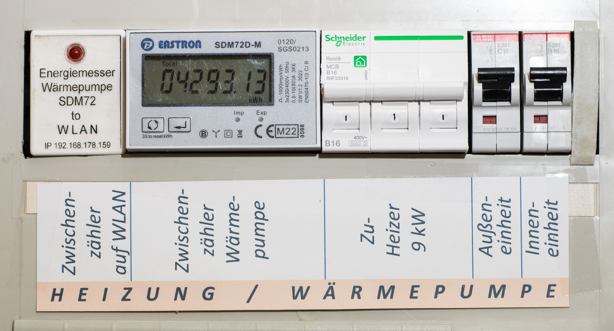

Maker Media GmbH

***

# Vom Energiemesser zum Smart Meter

### Wir verwandeln einen geeichten Energie- und Leistungsmesser in ein Smart Meter für Wallboxen und Wärmepumpen.

In PV-Anlagen mit Batteriespeicher lassen sich vorhandene Verbrauchsmesser mit wenig Aufwand als Smart Meter nutzen. Wir verwandeln einen geeichten Energie- und Leistungsmesser mit RS484-Schnittstelle und Modbus-RTU-Protokoll in ein Smart Meter für Wallboxen und Wärmepumpen und zeigen, wie man es im WLAN einbindet und die Verbrauchsdaten im Webbrowser ausgibt.

 

Den vollständigen Artikel mit der Bauanleitung gibt es in der [Make-Ausgabe 1/25 ab Seite 108](https://www.heise.de/select/make/2025/1/2501015555220177543). Hier finden Sie Listings und Zusatzinfos zum Beitrag.
